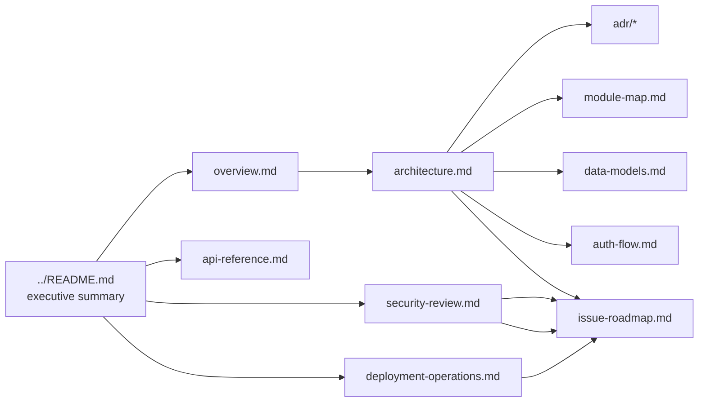

# tickets_api — Documentation

This directory contains the consolidated analysis of the `tickets_api` Rust web service (Axum + SQLx + PostgreSQL). The analysis was produced by a multi-specialist review (architecture, security/quality, and deployment/operations) and is organized below.

> 📌 Start with the [repository root `README.md`](../README.md) for the executive summary, status, and known blockers.

## How to navigate

| If you want to… | Read |
|---|---|
| Understand what the project is and its current state | [overview.md](overview.md) |
| Understand the architecture, layering, and design decisions | [architecture.md](architecture.md) + [adr/](adr/) |
| See the HTTP / RPC API contract | [api-reference.md](api-reference.md) |
| Inspect the code module-by-module | [module-map.md](module-map.md) |
| See the data models and DB schema (and the drift between them) | [data-models.md](data-models.md) |
| Understand the authentication/token flow | [auth-flow.md](auth-flow.md) |
| Review security & code-quality findings (S1–S15, Q1–Q10, OWASP) | [security-review.md](security-review.md) |
| Review Docker, compose, CI/CD, and ops readiness + fixes | [deployment-operations.md](deployment-operations.md) |
| Get the prioritized list of issues to fix and in what order | [issue-roadmap.md](issue-roadmap.md) |

## Document cross-reference

## Reading conventions

- **Source paths** are given relative to the Cargo project root — i.e. `src/server.rs` means `tickets_api/src/server.rs`. Repository-root files (e.g. `README.md`, `.github/workflows/`, `LICENSE`) are given relative to the repository root.
- **Line numbers** (e.g. `middleware/auth.rs:38-44`) refer to the latest `v2` branch state at the time of review.
- **Severity** is consistently tiered: `CRITICAL` ▸ `HIGH` ▸ `MEDIUM` ▸ `LOW`.
- Findings are tagged: **S1–S15** (security), **Q1–Q10** (code quality), **C1–C8** (Dockerfile), **D1–D12** (compose), **O1–O7** (observability), **G1–G13** (CI/CD gaps), and **P0–P3** (roadmap priority).

## Status at a glance

- **Architecture:** layered controller→service→model/store with an active JSON-RPC façade + a dormant in-memory REST stub. Solid skeleton, 6 P0 defects.
- **Security/Quality:** ❌ REJECT — auth inoperative, secrets committed, panic-based error handling.
- **Deployment/Ops:** ❌ 0/10 — container panics at startup; no quality gates in CI.
