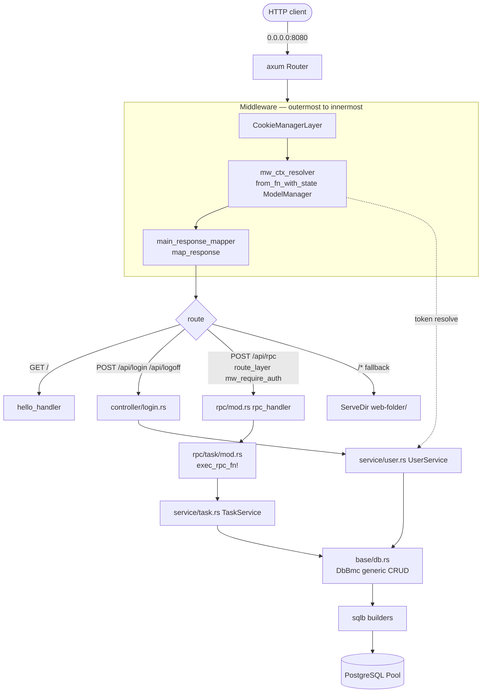
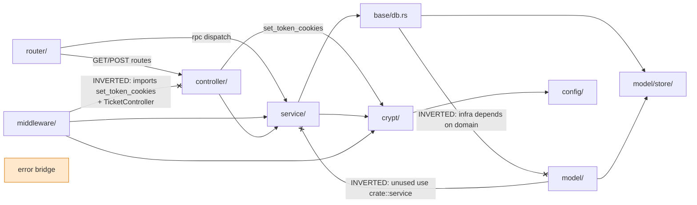

# Architecture

> This document describes the **as-built** architecture of `tickets_api` (latest `v2`), the intended layering, the violations found, the cross-cutting mechanisms (DI, error mapping, auth, config, observability), and the architectural issues & recommendations. It is the home of the [module dependency graph](#module-dependency-graph) and references the [ADRs](adr/).

## 1. Classification

**Layered (controller → service → model/store) architecture with two parallel presentation styles.**

- **Active façade** — a JSON-RPC-style dispatcher (`rpc/` → `service/task.rs` → `base/db.rs` generic CRUD) mounted at `POST /api/rpc`.
- **Dormant REST stack** — classic per-resource routes (`controller/tickets.rs` + `router/tickets.rs`) backed by an **in-memory** `TicketController` (`Arc<Mutex<Vec<Option<Ticket>>>>`) — **not the DB**. These routes are commented out in `server.rs`, but `TicketController::new().await.unwrap()` is still constructed at startup.

Request lifecycle:



## 2. Module dependency graph

The intended clean chain is `router → controller → service → base/db → store`. The actual graph contains **three inverted edges** and a broken `From` bridge.



### Issues in the dependency graph

| Issue | Detail | Fix direction |
|---|---|---|
| **Inverted edge: middleware → controller** | `middleware/auth.rs` imports `controller::login::set_token_cookies` and `TicketController`. Infrastructure depends on presentation. | Extract token-cookie logic into a non-controller module (e.g. `auth::session`) and have both `controller/login.rs` and `middleware/auth.rs` depend on it. |
| **Inverted edge: model → service** | `model/mod.rs` has an unused `use crate::service;`. Domain depends on service (dead import today). | Delete the unused import. |
| **Inverted edge: base/db → model** | `base/db.rs` depends upward on `model` (infra→domain). | Move `ModelManager`/`DB` types into a core crate layer so `base/db` depends on a shared domain type, not the aggregate `model` module; or fold `base/db` into the service layer. |
| **Broken `From` bridge** | `error::From<model::error::Error>` is **commented out** (`error/mod.rs:57-63`). Model errors cannot convert into app errors, forcing `.unwrap()` at the service/controller boundary. | Uncomment and implement the `From` impl so service errors propagate as `Result`. |

## 3. Dependency injection via axum `State`

There is no DI container. State is threaded with axum's `State`:

- `ModelManager` (`Clone`, holds `DB = Pool<Postgres>`) is cloned into routers via `.with_state(manager.clone())` and injected into handlers as `State<ModelManager>`.
- `TicketController` (legacy) is similarly `State`-fan-out.
- `CTX { user_id: u64 }` is extracted via a custom `FromRequestParts` that reads `Result<CTX>` from `parts.extensions` — populated by `mw_ctx_resolver` (today **not populated**, see P0-1).
- `Cookies` and `Option<CTX>` are supplied by the `CookieManagerLayer` and `map_response` layers respectively.

## 4. Error architecture

Single mapping pipeline with one good trait and one weak default arm:

```mermaid
flowchart LR
  Handler["handler returns Result<Json<T>>"] -->|Err e: Error| IntoResp["IntoResponse for Error<br/>→ 500 + insert self into extensions"]
  IntoResp --> Mapper[main_response_mapper<br/>map_response]
  Mapper -->|(extract Error from ext)| Map[client_status_and_error]
  Map -->|StatusCode + ClientError| Body["client body<br/>{\"error\":{\"type\": AsRefStr, \"req_uuid\": Uuid}}"]
  Mapper --> Log[log_request<br/>debug! RequestLogLine]
  Map -.->|everything unmapped → 500 SERVICE_ERROR| Body
```

- **Strength:** one mapping point, guaranteed consistent client body, no internal detail leakage into the *response* (only `type` + `req_uuid`), per-request `req_uuid` for correlation.
- **Weaknesses:**
  - Default arm `_ ⇒ 500 SERVICE_ERROR`. Unmapped variants (`TokenExpired`, `ValidationFail`, `UserNotFound`, all crypt/timer errors) collapse to 500 — wrong HTTP semantics and ops blindness (S9).
  - `log_request` runs at `debug!`; with `RUST_LOG=tickets_api=debug` in the prod compose config, internal `Error` data (incl. `user_id`, `CtxCreationFail(String)`) goes to logs.
  - No JSON-RPC error envelope — the RPC layer panics on `Err` instead of returning `{"id":… "error":{…}}` (combined with S4 DoS).

The `Error` enum has **21 variants** (`crate::error::Error`) with `#[serde(tag="type", content="data")]` + `strum_macros::AsRefStr`; `ClientError` has 4 variants (`LOGIN_FAIL`, `NO_AUTH`, `INVALID_PARAMS`, `SERVICE_ERROR`). Typos: `FailtToB643UrlDecode`, `LoginFailPwdNotMathing`, `UnkownRpcMethod`, `logff`.

## 5. Auth architecture

Custom signed-cookie token scheme (not JWT):

- **Token** = `b64u(ident).b64u(exp).sign_b64u`; `ident` = username, `exp` = RFC3339 timestamp, `sign` = `b64url(HMAC-SHA512(TOKEN_KEY, b64u(ident).b64u(exp) ‖ token_salt))`. Per-user `token_salt` (UUID) enables instant per-user revocation by rotating the salt.
- **Cookie** `auth-token`: `http_only(true)`, `path("/")` — **no `Secure`/`SameSite`/`Max-Age`** (P0-6 / S6).
- **Sliding renewal**: `mw_ctx_resolver` re-issues a fresh cookie on every authenticated request and removes the cookie on auth failure (except `TokenNotInCookie`).

See [auth-flow.md](auth-flow.md) for the full sequence diagram. The auth subsystem is currently **inoperative** (two independent blockers: `_generate_token` is `todo!()`, and `mw_ctx_resolver` never inserts `CTX` into extensions) — see [security-review.md](security-review.md) S1.

## 6. Configuration architecture

`OnceLock<Config>` singleton (`config::config()`), env-only — aligned with 12-factor *in spirit*:

- Loads `SERVICE_DB_URL`, `SERVICE_WEB_FOLDER`, `SERVICE_PWD_KEY`/`SERVICE_TOKEN_KEY` (base64url→bytes), `SERVICE_TOKEN_DURATION_SEC` (f64).
- `panic!("FATAL - WHILE LOADING CONFIG")` on any missing/malformed var. There is no fallback to defaults and no graceful exit.
- Dev defaults live in `.cargo/config.toml [env]`, which applies **only to `cargo` subcommands** — not to the bare `./tickets_api` binary launched by the Dockerfile `CMD`. This is the root cause of the container startup panic (see [deployment-operations.md](deployment-operations.md)).

The dev values include **committed secrets** (see S2).

## 7. Observability architecture

- `tracing_subscriber::fmt()` with `.without_time()` and `.with_target(false)`, `EnvFilter::from_default_env()`.
- No structured/JSON output, no `#[tracing::instrument]`, no metrics, no health/readiness endpoints, no graceful shutdown (`axum::serve(...).await.unwrap()`).

See [deployment-operations.md](deployment-operations.md) § Observability for the gaps and fixes.

## 8. Six P0 architectural blockers

| # | Blocker | Proof |
|---|---|---|
| P0-1 | **CTX never inserted into request extensions** → every `/api/rpc` returns 403 | `middleware/auth.rs:38-44` — `mut req` never mutated; `ctx_result` dropped |
| P0-2 | **Token generation is `todo!()`** → login panics | `crypt/token.rs:17-19` |
| P0-3 | **Dev bootstrap runs every startup** — hardcoded `postgres://postgres:welcome@db`, `DROP DATABASE`, `.unwrap()` → prod crash | `server.rs:16`, `_dev_utils/dev_db.rs:14-15` |
| P0-4 | **Schema ⇔ code drift** — `username` vs `name`; `task` vs `tasks`; `title` vs `name` | `01-create-schema.sql:4-17` vs `service/user.rs:15,38`, `service/task.rs:11` |
| P0-5 | **`unwrap`/panic on request path** — DB failure = dropped connection; `RpcMissingParams` panics | `rpc/task/mod.rs:15-43`, `rpc/mod.rs:32-46,64` |
| P0-6 | **Cookie missing `Secure`/`SameSite`** → CSRF | `controller/login.rs:21-23` |

## 9. Recommendations (architectural)

1. **Pick one presentation style.** Either commit to JSON-RPC (`rpc/`) and delete the dormant `router/tickets.rs` + `controller/{ticket,tickets}.rs`, or re-enable the REST stack over the DB with ownership scoping (S8). Don't carry both.
2. **Fix the dependency direction.** Resolve the three inverted edges and uncomment the `From<model::error::Error>` bridge so errors propagate as `Result` instead of `unwrap`.
3. **Feature-gate `_dev_utils`** behind `#[cfg(feature="dev-utils")]` (and remove `init_dev()` from `startup()` entirely — make it a `cargo` alias / `sqlx-cli migrate` step).
4. **Adopt `sqlx::migrate!()`** to make the schema a compile-time-checked artifact and eliminate the runtime schema-drift class of bugs (P0-4 / S15).
5. **Return errors, never panic.** Propagate `Result` through `rpc/task` fns; emit a JSON-RPC error envelope from `rpc_handler`; add a `#![deny(clippy::unwrap_used)]` (or CI gate) cut.
6. **Plan a dependency bump milestone** — axum 0.8, sqlx 0.8, rand 0.9 — once P0/P1 are clear.

Recommended sequencing: **fix auth (P0-1,2,6) → repair data layer + `From` bridges + purge unwraps (P0-4,5) → feature-gate dev code (P0-3) → pick one API style & fix dependency direction (P1) → observability/cleanup + the dep bump milestone (P2).**

The full prioritized roadmap is in [issue-roadmap.md](issue-roadmap.md).
