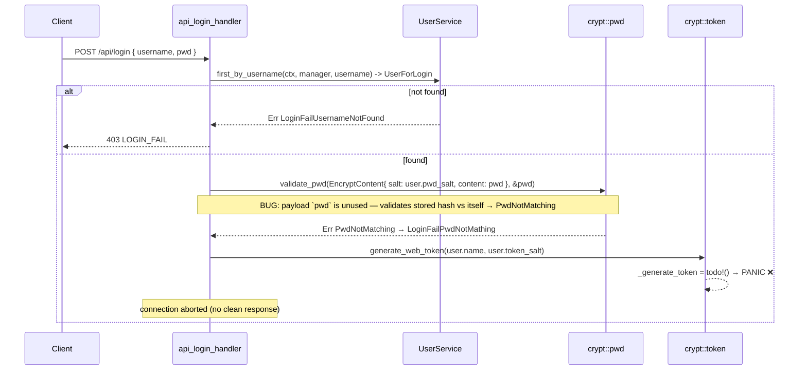
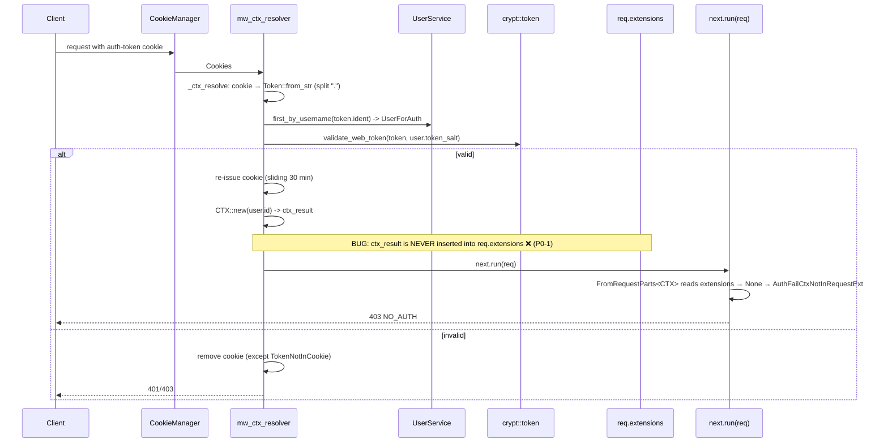

# Authentication Flow

The auth scheme is a **custom signed-cookie token** (not JWT bearer). This document walks through login, request resolution, cookie lifecycle, the token format, and the **two independent blockers** that make auth inoperative today.

## Token format

```
web-token = b64u(ident) "." b64u(exp) "." sign_b64u
```
- `ident` — the **username** (note: PII in the cookie value — S11 recommends using `user.id` instead).
- `exp` — RFC3339 UTC timestamp (`SERVICE_TOKEN_DURATION_SEC` = 1800 s / 30 min from issue).
- `sign_b64u` = `base64url(HMAC-SHA512(TOKEN_KEY, b64u(ident) "." b64u(exp) ‖ token_salt))`.
- `token_salt` — per-user UUID (`gen_random_uuid()` on the `user` row, **in the intended schema**; today it lives on `task` due to schema drift — S15).

Password storage: `#01#{base64url(HMAC-SHA512(PWD_KEY, pwd_clear ‖ pwd_salt))}`. Version prefix `#01#`; per-user `pwd_salt`.

> ⚠️ Both `PWD_KEY` and `TOKEN_KEY` are committed dev values that decode to the ASCII strings `dev_only_pwd_key` / `dev_only_token_key` (~zero entropy) — see [security-review.md](security-review.md) S2. Passwords use keyed HMAC-SHA512, **not a KDF** (no work factor) — S3.

## Login (`POST /api/login`)



**Two bugs in the login path:**
1. `validate_pwd` is called with `content: pwd` (the user's *stored* pwd in the current code path is mismatched) — the cleartext `pwd` from the payload is effectively unused, so the comparison is the stored hash against itself → always `PwdNotMatching` → `LoginFailPwdNotMathing`. (A correct flow would hash the payload `pwd_clear` with the user's `pwd_salt` and compare against the stored `pwd`.)
2. Even if validation passed, `generate_web_token` → `_generate_token` is `todo!()` → **panic**. Login never returns a token.

## Request resolution (`mw_ctx_resolver`)



**Bug:** `mw_ctx_resolver` (`middleware/auth.rs:38-44`) computes `ctx_result` but never calls `req.extensions_mut().insert(ctx_result)`. The `CTX` extractor (`FromRequestParts`) reads `parts.extensions.get::<Result<CTX>>()` — always `None` → `AuthFailCtxNotInRequestExt` → **every authenticated request returns 403**, even with a valid cookie. No `/api/rpc` call can currently succeed.

**Fix (sketch):**
```rust
// middleware/auth.rs — in mw_ctx_resolver, before next.run(req):
let ctx_result = _ctx_resolve(manager, &cookies).await; // existing
req.extensions_mut().insert(ctx_result);                 // ADD THIS
next.run(req).await
```
And implement `_generate_token`:
```rust
fn _generate_token(ident: &str, duration_sec: f64, salt: &str, key: &[u8]) -> Result<Token> {
    let exp = now_utc_plus_sec_str(duration_sec);
    let sign_b64u = _token_sign_into_b64url(ident, &exp, salt, key)?;
    Ok(Token { ident: ident.to_string(), exp, sign_b64u })
}
```

## `CTX` & require-auth

- `CTX { user_id: u64 }`; `CTX::new` rejects `user_id == 0` (`CannotNewRootCtx`); `root_ctx()` (0) is used by login/services.
- `mw_require_auth(ctx: Result<CTX>, req, next)` — fails fast via `ctx?`, else passes through. Gated as a `route_layer` on the `/api` subtree (so it runs before `rpc_handler`).

## Cookie lifecycle

| Event | Action |
|---|---|
| Login success | `set_token_cookies` — `auth-token`, `HttpOnly`, `Path=/` (**no Secure/SameSite/Max-Age**) |
| Each authenticated request | `mw_ctx_resolver` re-issues a fresh 30-min cookie (**sliding renewal**) |
| Logoff | `remove_token_cookies` — client cookie delete (`Path=/`); **token stays valid** (no `token_salt` rotation / server-side revocation) |
| Auth failure (non-`TokenNotInCookie`) | cookie removed |

**Weaknesses:** sliding renewal with no absolute cap → a stolen cookie stays alive indefinitely while the victim browses (S6); logoff does not revoke; no `Secure` → token sent over plain HTTP off-localhost; no `SameSite` → CSRF surface (P0-6); username PII in cookie visible to proxies/loggers (S11).

## Summary of auth blockers

| # | Blocker | Location | Fix |
|---|---|---|---|
| 1 | `_generate_token` is `todo!()` | `crypt/token.rs:17-19` | Implement (sketch above) |
| 2 | `CTX` never inserted into extensions | `middleware/auth.rs:38-44` | `req.extensions_mut().insert(ctx_result)` |
| 3 | login `validate_pwd` uses wrong content | `controller/login.rs` | use `content: payload.pwd`, compare to stored hash |
| 4 | schema drift — salts/columns on wrong table | `01-create-schema.sql` | reconcile schema (see [data-models.md](data-models.md)) |
| 5 | broken access control — `ctx` ignored (IDOR) | `base/db.rs` | scope queries by `ctx.user_id()` (S8, hidden until 1–4 are fixed) |

Detailed findings: [security-review.md](security-review.md) S1, S6, S8, S11, S15.
