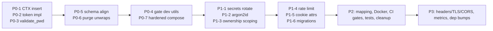

# Issue Roadmap & Remediation Plan

Consolidated issue register derived from the full multi-specialist review (Wilson/architecture, Carla/security+quality, Atlas/DevOps). All findings from [architecture.md](architecture.md), [security-review.md](security-review.md), and [deployment-operations.md](deployment-operations.md) are merged here with a single priority taxonomy.

**Ground rule:** nothing here can be shipped until **P0** is closed. The current state — container panic-crashes before binding, login panics, and every authenticated request 403s — means deployment is impossible until the items below land.

---

## Severity legend

- **P0** — blockers: app cannot run end-to-end; do not deploy
- **P1** — security must-fix before exposing any endpoint
- **P2** — hardening & code-cleanup
- **P3** — defense-in-depth

Effort: **S** small (<1 day) · **M** medium (2–4 days) · **L** large (1+ week)

---

## P0 — Blockers (fix first; ~4–6 dev days)

| ID | Finding | Source mapping | Effort |
|---|---|---|---|
| P0-1 | **Auth non-functional — CTX never inserted into request extensions** → every `/api/rpc` returns 403. Fix: `req.extensions_mut().insert(ctx_result)` in `mw_ctx_resolver` | S1(2nd) / arch P0-1 | S |
| P0-2 | **Auth non-functional — token generation is `todo!()`** → login panics. Implement `_generate_token` | S1(1st) / arch P0-2 | S |
| P0-3 | **Login `validate_pwd` compares stored hash against itself** (payload `pwd` unused) → always `PwdNotMatching` | [auth-flow.md](auth-flow.md) | S |
| P0-4 | **Dev DB bootstrap runs on every startup** — hardcoded `postgres://postgres:welcome@db`, `DROP DATABASE`, `.unwrap()`. Gate `_dev_utils` behind `feature = "dev-utils"` / `debug_assertions` | S7 / arch P0-3 / Atlas Fix 1 | S |
| P0-5 | **Schema ⇔ code drift** (`username` vs `name`; `task` vs `tasks`; `title` vs `name`; salts on `task` not `user`) — reconcile schema **and** models | S15 / arch P0-4 / Atlas | M |
| P0-6 | **`unwrap`/panic on request path** — RPC layer panics on any error (7 unwraps in `exec_rpc_fn!`), 35 unwrap/expect/todo sites total. Propagate `Result` + JSON-RPC error envelope | S4 / arch P0-5 | M |
| P0-7 | **Compose missing 4 of 6 env vars; `.cargo/config.toml [env]` inert for bare binary** — container panics at startup. Ship the hardened compose + `.env` template | Atlas D1/D2 / S10(d) | S |

### Definition of done (P0)

- [ ] `POST /api/login` returns 200 + `auth-token` cookie (HTTP test proves: no-cookie → 401/403, valid-cookie → 200, tampered signature → rejected)
- [ ] `POST /api/rpc` returns 200 for valid calls against the live DB
- [ ] `cargo run` in prod mode never touches `sql/dev_initial/` or `DROP DATABASE`
- [ ] `cargo clippy --all-targets --all-features -- -D warnings -W clippy::unwrap_used` passes
- [ ] Container boots with the hardened compose against a healthy Postgres

---

## P1 — Security must-fix before exposure

| ID | Finding | Source | Effort |
|---|---|---|---|
| P1-1 | **Rotate & externalize secrets** — remove PWD_KEY/TOKEN_KEY/DB creds from `.cargo/config.toml`, SQL, compose; purge git history (`git filter-repo`); add gitleaks/trufflehog to CI | S2 | S |
| P1-2 | **Replace HMAC-SHA512 password hashing with argon2id** (constant-time verify; keep PWD_KEY as pepper; migrate `#01#` on next login) | S3 | M |
| P1-3 | **Fix broken access control (IDOR)** — add `cid` column to `task`; thread `ctx.user_id()` into `base::db` queries (`and_where("cid","=",…)`) | S8 | M |
| P1-4 | **Add rate limiting & lockout** on login (`tower_governor`, 5/min per-IP + per-username); remove `welcome` demo reset in non-dev builds | S5 | M |
| P1-5 | **Harden session cookie** — `Secure`, `SameSite::Strict`, `Max-Age`; absolute max lifetime (~8 h); rotate `token_salt` on logoff (real server-side revocation) | S6 | S |
| P1-6 | **Adopt `sqlx::migrate!`** — schema becomes compile-time-checked artifact; delete naive `pexec` SQL runner | S14/S15 / Atlas | M |

---

## P2 — Hardening & cleanup

| ID | Finding | Source | Effort |
|---|---|---|---|
| P2-1 | Explicit error→HTTP mapping (401 token, 403 creds, 404 not-found, 400 validation); unified `INVALID_CREDENTIALS`; keep internal `Debug` out of logs | S9 | S |
| P2-2 | Docker hardening — slim runtime, `USER 10001`, HEALTHCHECK, digest pinning, `cap_drop`, `.dockerignore` improvements | S10 / Atlas C1–C8 | M |
| P2-3 | Graceful shutdown (`with_graceful_shutdown`), `/health` + `/ready` endpoints | Atlas O5/O6 / Fix 3–4 | S |
| P2-4 | Commit `Cargo.lock` (remove from `.gitignore`) | Atlas G-class | S |
| P2-5 | Remove dead code: `todo!()`, `parse_token`, unused `TicketController` import, dormant REST stack (Q2/Q3 — pick one API style) | Q1–Q3 | M |
| P2-6 | Fix the 4 no-op tests (add `#[tokio::test]`/`#[test]`) + wire up `httpc-test` for HTTP-layer tests; target ≥80% on critical paths | Q6/Q10 | M |
| P2-7 | Fix typos: `PwdNotMathing`, `FailtToB643UrlDecode`, `UnkownRpcMethod`, `logff` | Q7 | S |
| P2-8 | Add CI quality gates: fmt, clippy, test (with PG service), `cargo audit`, build `--locked`, SBOM; update `checkout@v4`; add Dependabot | Atlas G1–G13 | M |
| P2-9 | Configurable pool (`SERVICE_DB_MAX_CONNS`, `SERVICE_DB_ACQUIRE_TIMEOUT_MS`) | Atlas Fix 6 | S |
| P2-10 | Structured JSON logs with timestamps; prod-level `RUST_LOG` | Atlas O1–O3/O7 Fix 7 | S |
| P2-11 | Handle dropped `Result`s (`update_pwd`, `observability::startup()`, `init_dev`) | Q9 | S |

---

## P3 — Defense in depth

| ID | Finding | Source | Effort |
|---|---|---|---|
| P3-1 | Constant-time token signature compare (`subtle`); put `user.id` in token ident (no username PII); remove `unwrap()`s in `token.rs` | S11 | S |
| P3-2 | Security headers layer, TLS termination docs, CORS allowlist (`tower-http` features) | S12 | M |
| P3-3 | Input validation: `#[serde(deny_unknown_fields)]`, length limits, body-size cap | S13 | S–M |
| P3-4 | Fix `dev_only_pws` SQL password typo; SQL-proof runner (migrate!) | S14 | S |
| P3-5 | Metrics (Prometheus) + `tokio` feature slimming + `[profile.release]` LTO/strip | Atlas | M |
| P3-6 | Dependency bump milestone: axum 0.8, sqlx 0.8, rand 0.9 (after P0/P1 stabilize) | Wilson sequence | L |

---

## Recommended execution order

**Rationale:** fix auth first (unblocks everything), then make the data layer truthful, then stop the container from destroying itself, then close the security holes before anyone can reach the API.

---

## Verification checklist before each gate

### Before local demo (`cargo run` + local PG)

- [ ] login returns a cookie; `/api/rpc` responds 200 with a valid cookie and 401/403 without
- [ ] clippy clean with `-D clippy::unwrap_used`
- [ ] `cargo test --all-targets` green (task CRUD + auth tests)

### Before container deploy

- [ ] hardened Dockerfile builds (<150 MB)
- [ ] hardened compose boots: api healthy (curl `/health`), db healthy (`pg_isready`)
- [ ] secrets: none in git, all via `.env`/secrets manager
- [ ] `cargo audit` clean; `Cargo.lock` committed

### Before public exposure

- [ ] argon2id in place; IDOR fixed; rate limiting active
- [ ] `Secure` cookie + TLS termination; security headers
- [ ] CI gates all green (fmt/clippy/test/audit/build)